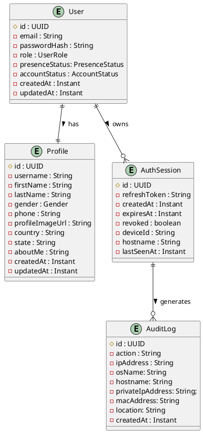

# Access Control Schema

```plantuml
@startuml
' Entities
entity "User" as U {
  #id : UUID
  -email : String
  -passwordHash : String
  -role : UserRole
  -presenceStatus: PresenceStatus
  -accountStatus : AccountStatus
  -createdAt : Instant
  -updatedAt : Instant
}

entity "Profile" as P {
  #id : UUID
  -username : String
  -firstName : String
  -lastName : String
  -gender : Gender
  -phone : String
  -profileImageUrl : String
  -country : String
  -state : String
  -aboutMe : String
  -createdAt : Instant
  -updatedAt : Instant
}

entity "AuthSession" as S {
  #id : UUID
  -refreshToken : String
  -createdAt : Instant
  -expiresAt : Instant
  -revoked : boolean
  -deviceId : String
  -hostname : String
  -lastSeenAt : Instant
}

entity "AuditLog" as L {
  #id : UUID
  -action : String
  -ipAddress : String
  -osName: String
  -hostname: String
  -privateIpAddress: String;
  -macAddress: String
  -location: String
  -createdAt : Instant
}

' Relationships
U ||--|| P : has >
U ||--o{ S : owns >
S ||--o{ L : generates >

@enduml
```
